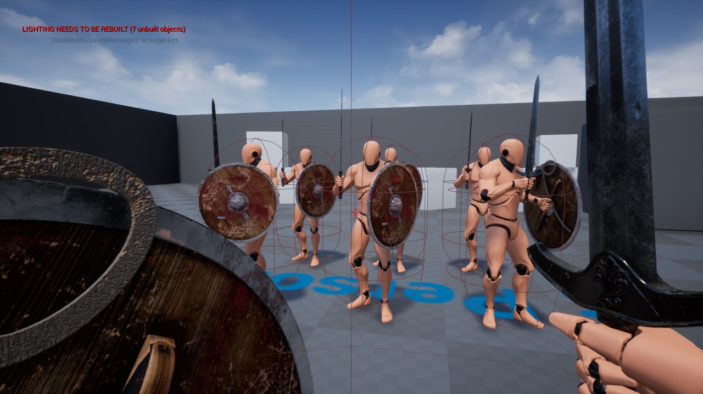

# MedievalCombatTest
A medieval combat system created in Unreal Engine 4, programmed in c++ and blueprints. 

## Features

- Networked turn in place animation system.
- Networked combat animations.
- Full body visibility in both first person and third person.
- Single animation set used for both first person and third person.

